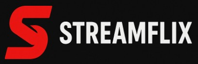

<!-- BANNER -->
<p align="center">
  
</p>

<h1 align="center">🎬 NEXTJS-NETFLIX-CLONE</h1>
<p align="center">
  <b>Next.js v13+ · Tailwind CSS · Firebase · Stripe · TMDB API</b>
</p>

<p align="center">
  <a href="<!-- 배포 URL 넣기 -->">
    
  </a>
  <a href="<!-- GitHub 저장소 URL 넣기 -->">
    
  </a>
  
  
  
</p>

---

## ✨ 기능
- 🔐 **인증/프로필**: Firebase Auth(이메일/소셜) 기반 로그인, 프로필/아바타 관리
- 💳 **구독 결제**: Stripe 결제로 플랜 구독/결제 내역 확인
- 🎞️ **콘텐츠**: TMDB API로 영화/시리즈 목록, 디테일, 카테고리(Trending/Top Rated 등)
- 🧡 **마이 리스트**: 즐겨찾기/최근 시청 저장
- 🔎 **검색/필터**: 제목·장르 기반 검색
- 🚀 **최적화**: Next.js App Router(13+) 기반 SSR/ISR, 이미지 최적화
- 📱 **반응형 UI**: Tailwind CSS로 모바일~데스크톱 대응

> ※ 위 항목은 템플릿입니다. 실제 구현 범위에 맞게 체크/수정하세요.

---

## 🧰 기술 스택
<p align="center">
  
  
  
  
  
  
  
</p>

---

## 📦 설치 & 실행
```bash
# 1) 레포지토리 복제
git clone <YOUR_REPO_URL>
cd nextjs-netflix-clone

# 2) 의존성 설치
npm install

# 3) 환경 변수 설정
# .env.local 생성 후 아래 값 채우기 (아래 표 참고)

# 4) 개발 서버 실행
npm run dev
# URL: http://localhost:3000
